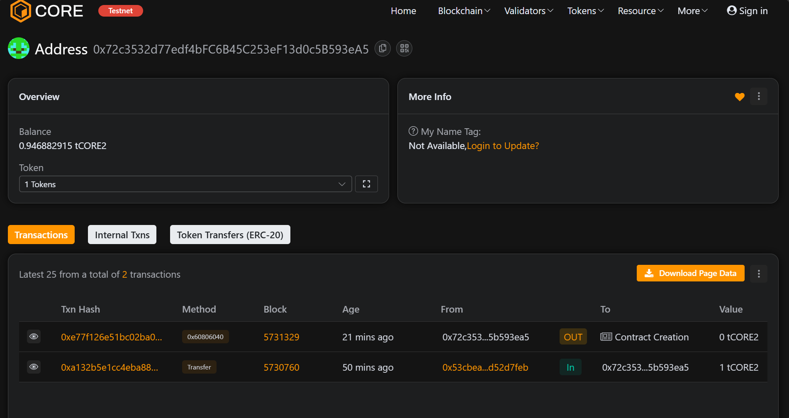

# EduToken

## Project Description

EduToken is a blockchain-based educational incentive system that leverages the power of cryptocurrency to revolutionize learning and teaching experiences. Built on the Core Blockchain, EduToken creates a decentralized ecosystem where students can earn tokens for their academic achievements, participation, and learning milestones, while educators can reward and motivate learners through token-based incentives.

The platform addresses the traditional challenges of educational motivation by introducing a transparent, secure, and rewarding system that encourages continuous learning and engagement. Students can accumulate EduTokens through various educational activities, creating a gamified learning environment that promotes active participation and knowledge acquisition.

## Project Vision

Our vision is to transform the educational landscape by creating a global, decentralized learning economy where knowledge acquisition is directly rewarded and incentivized. EduToken aims to bridge the gap between traditional education systems and modern blockchain technology, fostering a community-driven approach to learning where students, educators, and institutions can collaborate seamlessly.

We envision a future where educational achievements are permanently recorded on the blockchain, creating an immutable record of learning progress that can be verified globally. This system will democratize access to educational rewards and create new opportunities for students worldwide, regardless of their geographical location or economic background.

## Key Features

- **Token-Based Rewards System**: Students earn EduTokens for completing assignments, achieving milestones, and demonstrating academic excellence
- **Educator Management**: Secure registration system for educators with permission-based token distribution capabilities
- **Transparent Tracking**: All token transactions and rewards are recorded on the blockchain for complete transparency
- **Reward Points System**: Comprehensive tracking of student achievements through accumulated reward points
- **Decentralized Architecture**: Built on Core Blockchain ensuring security, immutability, and global accessibility
- **Standard ERC-20 Compliance**: Full compatibility with existing cryptocurrency wallets and exchanges
- **Owner Controls**: Administrative functions for managing educators and overseeing the token ecosystem
- **Secure Transfers**: Safe and efficient token transfer mechanisms with built-in security checks

## Future Scope

The EduToken ecosystem is designed for continuous expansion and enhancement. Future developments include:

- **Multi-Institution Integration**: Partnerships with schools, universities, and online learning platforms worldwide
- **NFT Certificates**: Integration of non-fungible tokens for unique educational achievements and certifications
- **Marketplace Development**: A dedicated marketplace where students can spend their earned tokens on educational resources, courses, and materials
- **AI-Powered Assessment**: Implementation of artificial intelligence for automated grading and token distribution
- **Cross-Chain Compatibility**: Expansion to multiple blockchain networks for broader accessibility
- **Mobile Application**: Development of user-friendly mobile apps for students and educators
- **Governance Token**: Evolution into a DAO (Decentralized Autonomous Organization) with community governance features
- **Scholarship Programs**: Token-funded scholarship opportunities for outstanding students
- **Corporate Partnerships**: Collaboration with employers who recognize EduToken achievements in hiring processes

## Contract Details

*[This section is reserved for manual completion with specific deployment information, contract addresses, and technical specifications]*

## Deployment

### Prerequisites
- Node.js installed
- Hardhat framework setup
- Core Blockchain testnet configuration
- Private key configured in `.env` file

### Deployment Steps
1. Clone the repository
2. Install dependencies:
   ```bash
   npm install
   ```
3. Configure your `.env` file with your private key:
   ```
   PRIVATE_KEY=your_private_key_here
   ```
4. Deploy to Core Blockchain testnet:
   ```bash
   npx hardhat run scripts/deploy.js --network coreTestnet
   ```

### Deployment Screenshot
*[Add your deployment screenshot here]*


